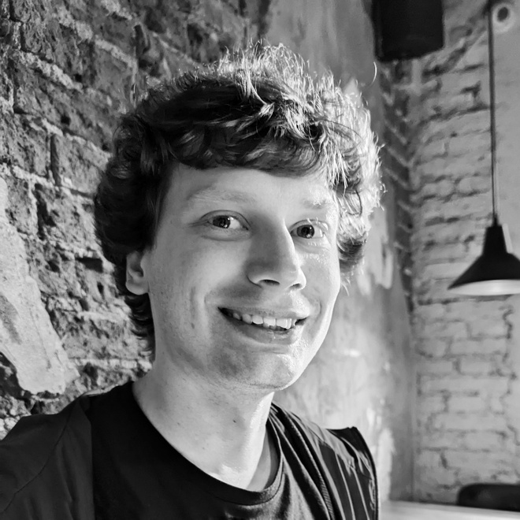

# Nikita Kurlat
**Quality Assurance Specialist**

## About me
Dedicated and detail-oriented Junior QA-specialist with
6 years of work experience in various fields. Eager to
apply skills gained while studying for IT-company in
detecting errors and preventing defects from occuring in
products. Excited to learn more about the Automation QA
Engineer role and become a valuable asset to your team.
## EducatiEducation Background
* **Russian Biotechnological University**
Informatics and Computer Engineering Completed in 2022
* **Moscow Power Engineering Institute**
Electronics and Nano-electronics
(Lighting technology and light sources)
2016-2019
* **Online educational platform Netology**
Professional retraining in the specialty
"QA Engineer"
2023-2024

## Hard Skills
* Knowledge of software QAmethodologies, tools and processes
* English skills (written and verbal - В2)
* Experience working with JIRA
* Using object-oriented programming
* Preparation of a test report
* Office productivity software (e.g.,Microsoft Office, Google Workspace)

## Soft Skills
* Ability to meet challenging deadlines
* Multi-tasking
* Quick adaptation

## Contacts
:email: honeykurlt@gmail.com 